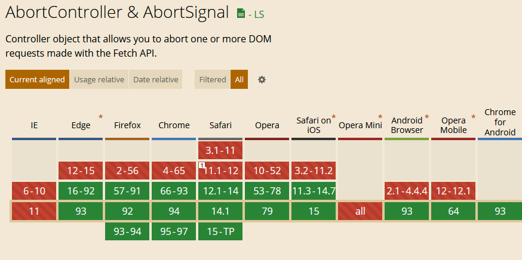

name: title
class: middle, center

# Promises: <br> Neue APIs und Pitfalls
<!---->36. Kasseler Webmontag
<br>
<!---->27. September 2021
<br>
**Niklas Mollenhauer**

???
- Fragen können gerne mittem im Vortrag gestellt werden
- **Umfrage** Wer nutzt Promises?
- Talk und Beispiele basieren teilweise auf einem anderen Talk eines Node-Code-Contributor
	- Link am Ende mit mehr Beispielen

---
layout: true
.footer[<!---->36. Kasseler Webmontag — 27. September 2021]

---
## Inhalt
- Was ist ein Promise?
- Pitfalls und Antipatterns
- (Neue) APIs auf `Promise.*`
- Abbrechen von Promises

???
- **Umfrage**: Wer hatte schonmal eine unhandled Promise rejection?

---
## `Promise`
- Typ in JavaScript, seit ES6 / ES2015
--

- Stellt eine asynchrone Operation dar
	- Wird von einer Funktion zurückgegeben, die asynchron läuft

--
- Alternative zu Callbacks

--
- Mehrere Zustände:
	- `pending` und `settled`
	- Settled unterteilt in `fulfilled` und `rejected`

--
- Mit `async`/`await` verwendbar

???
- In anderen Sprachen nennt man das Future (Java, C++) oder Task (C#)
---
## `Promise` - Verwendung 1/2
```js
const somePromise = fetch("https://webmontag-kassel.de");

somePromise.then(result => {
		console.log("Fertig");
		console.log(result);
	})
	.catch(err =>  {
		console.log("Fehler: " + err);
	});
```
---
## `Promise` - Verwendung 2/2

```js
const somePromise = fetch("https://webmontag-kassel.de");

try {
	const result = await somePromise;
	console.log("Fertig");
	console.log(result);
} catch (err) {
	console.log("Fehler: " + err);
}
```
???
- **Wichtige Beobachtung**: Man awaited immer ein Promise, woehr das kommt, ist egal
	- man awaited keine "Funktionen", nur deren Rückgabewerte
	- Wird häufig falsch verstanden
- **Promises und async functions gehören eng zusammen**
---
## Promises - Verwendung 2.5/2
```js
async function someAsyncFunction() {
    console.log("Ready...");
    try {
        const result = await foo();
        console.log("Result: " + result);
    } catch (err) {
        console.log(":( " + err);
    }
}
// alternativ
function someFunction() {
    console.log("Ready...");
    return foo()
        .then(result => console.log("Result: " + result))
        .catch(err => console.log(":( " + err))
}
```
???
- **Beobachtrung**: Eine `async` function returnt immer ein `Promise`!
- **`await`** macht aus den Sachen bei `catch` eine Exception

---
## Pitfall 1
"Jede Sekunde einen Request absetzen"

```js
fetch("https://webmontag-kassel.de")
```

--
```js
setInterval(async () => {
    await fetch(/* ... */); console.log("done fetching");
}, 1000);
```

--
```js
setInterval(async () => {
    throw new Error(/* ... */);
}, 1000);
```

--
```js
setInterval(() => {
	return Promise.reject(new Error(/* ... */));
}, 1000);
```

???
- **Wie fange ich diesen Fehler?**
- Durch das Async wird der Fehler nirgends fangbar

---
## Pitfall 1

```js
new Promise(async (resolve, reject) => {
  throw new Error()
}).catch(err => console.log("Oh nein :("))
```

---
## Pitfall 1

--
```js
const EventEmitter = require("events");

const e = new EventEmitter();
e.on("irgendwas", async () => {
	/* ... */
});
```

--
```
(node:4796) UnhandledPromiseRejectionWarning: Unhandled promise rejection (rejection id: 1): Error:
[1] (node:4796) DeprecationWarning: Unhandled promise rejections are deprecated.
In the future, promise rejections that are not handled will terminate the Node.
js process with a non-zero exit code.
```

--
- **Node.js beendet sich seit v15**

--
- Probleme: File-Descriptoren nicht geschlossen etc
- ggf. mit `process.on("unhandledRejection")` reagieren
???
- Sobald man `async` schreibt, muss einem bewusst sein, dass diese Funktion jetzt was anderes zurückgibt

---
## Pitfall 1
- **Pitfall 1: `async` Functions als Callbacks übergeben, wo es nicht erwartet wird**

--
- Lösungen:
	- All-in-Promise oder All-in-Callbacks, nicht mischen

--
	- Für Ersteres:
		- `require("fs").promises`
		- `require("timers/promises")`
		- `new EventEmitter({captureRejections: true})`

--
		- `require("util").promisify`


---
## Pitfall 2

```js
const data = [];
for(let i = 0; i < 1000; ++i)
	data.push(i);

async function mapData() {
	return await Promise.all(
		data.map(async (i) => {
			// Do some work, or
			const res = await fetch(/* ... */);
			return await res.json();
		})
	)
}
mapData().then(console.log);

```
???
- JS hat nur einen Thread für Berechnungen
	- asynchrone Callbacks passieren nicht auf einem anderen Thread
- Hier werden mindestens 1000 Promises erstellt
- ggf. Playground zeigen
- **Was passiert, wenn ein Promise davon rejected wird?**
	- *Alle* laufen weiter
---
## Pitfall 2
- **Pitfall 2: Promises in (synchronen) Schleifen anlegen**

--
- `Promise.all` bricht keine Promises ab

--
- viele Promise-Allocations

--
- Lösungen:

--
	- Überlegen, ob man es anders machen will

--
	- ggf. sequentielle Bearbeitung

--
		- Verhindert weitere Tasks, wenn ein Fehler auftritt
		- `for...of { await ... }`
		- ggf. `for await...of { ... }`

--
	- ggf. Requests/Promises batchen
		- "immer nur maximal n Requests gleichzeitig"

--
	- Anzahl kleinhalten

---
## Antipattern

--
```js
async function toUpper(items) { return items.map(i => i.toUpperCase()); }
async function toLower(items) { return items.map(i => i.toLowerCase()); }
async function reverse(items) {
	return items.map(i => [...i].reverse().join(""));
}
async function getData() {
  return ["tEsT", "HeLlO", "wOrLd"];
}
getData()
  .then(toUpper)
  .then(toLower)
  .then(reverse)
  .then(console.log);
```

???
- Beispiel aus einem anderen Talk
- Wird gern "für die Lesbarkeit" gemacht
- *Alles wird synchron ausgeführt*
- Hier passiert nichts asynchrones
	- Der Code wird einfach nur etwas später ausgeführt, aber synchron blockend
- ggf. TS-Playground zeigen

---
## Antipattern
- **Synchone Datenverarbeitung künstlich "asynchon" machen**

--
- Unnötige Promise-Allocations
- Alles wird weiterhin synchron, blockend ausgeführt
	- ...nur im nächsten Eventloop-Tick

--
- Kann Performance um [60-70% verschlechtern](https://youtu.be/XV-u_Ow47s0?t=1344)

---
name: title
class: middle, center

# Neue APIs
---
## `Promise.*` - ES2015
- Auch "Promise combinators" genannt

--
- `Promise.all(promises: Promise[]): Promise`
	- `resolved`, wenn:
		- _alle_ fertig sind

--
		- _irgendein_ Eingabe-Promise `rejected` wurde

--
			- Die anderen laufen aber weiter!
			- ...und können auch noch fehlschlagen

--
- `Promise.race(promises: Promise[]): Promise`
	- `resolved`, wenn _irgendein_ Eingabe-Promise `settled` (fertig) ist

--
		- `rejected` _oder_ `fulfilled`
???
- Nennt man Short-Circuiting
- Nimmt eigentlich kein Array, sondern ein Iterable von Promises

---
## `Promise.*` - ES2020

--
- `Promise.allSettled(prs: Promise[]): Promise<Promise[]>`

--
	- Wartet auf **alle** Promises
	- Gibt alle Promises zurück

--

```js
const promises = [
	fetch("index.html"),
	fetch("https://does-not-exist/"),
];
const results = await Promise.allSettled(promises);
const errors = results
	.filter(p => p.status === "rejected")
	.map(p => p.reason);
```
???
- Unterschied zu `all`:
	- Man wartet immer auf alle
	- Bricht nicht ab, wenn eins rejected ist
	- Wenn `all` rejected, können auch noch andere rejected sein

---
## `Promise.*` - ES2021
- `Promise.any(promises: Promise[]): Promise`
- fertig, wenn

--
	- _irgendein_ Eingabe-Promise `fulfilled` ist
	- alle `rejected` wurden
		- mit einem `AggregateError`, der alle Fehler enthält


--

Coole Übersicht auf: https://v8.dev/features/promise-combinators

---
## Abbrechen von Promises
- Leider nicht allgemein möglich
--

- Arbeit an abbrechbaren Promises [stagniert](https://github.com/tc39/proposal-cancellation)
--

- Aber in manchen Fällen schon!
--

- `fetch()`: Lange Requests abbrechen
--

- APIs: `AbortController` und `AbortSignal`
???
- Eigentlich keine neue Promise-API, fällt aber in eine ähnliche Richtung

---
## `AbortController`
```js
const abortController = new AbortController();


fetch("https://webmontag-kassel.de", {

	signal: abortController.signal

}).catch(err => console.log(err.message));


abortController.abort();
```
---
## `AbortController`-Use-Case
```js
const timeout = new Promise((resolve, reject) => {
    setTimeout(() => reject(new Error("Took too long")), 5000);
});

await Promise.race([
    timeout,
    fetch("http://webmontag-kassel.de"),
]);
```

--
- Problem: `fetch` wird nicht abgebrochen
	- Server sendet weiter Daten

---
## `AbortController`-Use-Case
```js

const controller = new AbortController();

setTimeout(() => controller.abort(), 5000);

await fetch("http://webmontag-kassel.de", {
	signal: controller.signal
});
```

---
## `AbortController`
- Ein Signal für mehrere `fetch()` möglich :)

--
- Nachteil: Immer Anwendungsspezifisch :/

--
- Aktuell nur unterstützt in `fetch()`

--
	- ..und `EventTarget`/`EventListener`

???
- Nachteil: Die JS-API muss cancellation per Signal explizit implementieren
- `AbortController`/`AbortSignal` ist ähnlich zu `CancellationTokenSource`/`CancellationToken` aus .NET
- Lange Requests abbrechen
	- Z. B. wenn der User auf eine neue Unterseite navigiert
	- Oder für einen Cancel-Button bei einem Video-Dowenload mit `fetch()`

---
## `AbortController` mit `EventTarget`

```js
const element1Handler = () => foo();
const element2Handler = () => bar();
const element3Handler = () => baz();

element1.addEventListener("click", element1Handler);
element2.addEventListener("click", element2Handler);
element3.addEventListener("click", element3Handler);

//...

element1.removeEventListener("click", element1Handler);
element2.removeEventListener("click", element2Handler);
element3.removeEventListener("click", element3Handler);
```
--

- Wir müssen uns die Handler alle zwischenspeichern :(
--

- Für jedes `addEventListener` ein `removeEventListener` :/

---
## `AbortController` mit `EventTarget`
```js
const controller = new AbortController();
const signal = controller.signal;

element1.addEventListener("click", () => foo(), { signal });
element2.addEventListener("click", () => bar(), { signal });
element3.addEventListener("click", () => baz(), { signal });

// Alle Handler auf einmal entfernen
controller.abort();
```
--

- Keine `removeEventListener` mehr :)
- Wir müssen uns die Handler nicht mehr merken :)

???

---
## `AbortSignal` selbst verwenden
```js
function createCancellableInterval(func, delay, signal) {
	const intervalId = setInterval(func, delay);

	signal.addEventListener("abort", () => {

		clearInterval(intervalId);
		console.log("Interval aborted");

	}, { once: true });
}

const controller = new AbortController();

createCancellableInterval(() => {
	console.log("hi");
}, 1000, controller.signal);

setTimeout(() => controller.abort(), 4000);
```
???
- Wir könnten diesen Timer jetzt mit demselben Signal verwenden, wie mit dem `fetch()` und beides gleichzeitig abbrechen

---

## CanIUse `AbortController`?

https://caniuse.com/abortcontroller

---
## Weiterführendes
- [Broken Promises - James Snell, NearForm](https://www.youtube.com/watch?v=XV-u_Ow47s0)
	- https://github.com/jasnell/broken-promises
- Promisified Node.js setTimeout, setInterval: `require("timers/promises")`
	- https://nodejs.org/api/timers.html
- `require("util").promisify`
	- https://nodejs.org/dist/latest-v8.x/docs/api/util.html
- `require("fs").promises`
	- https://nodejs.org/dist/latest-v10.x/docs/api/fs.html
- [Promise Combinators](https://v8.dev/features/promise-combinators): `all`, `allSettled`, `any`, `race`
- [`AbortController` und `AbortSignal` (MDN)](https://developer.mozilla.org/en-US/docs/Web/API/AbortController)
	- [developers.google.com dazu](https://developers.google.com/web/updates/2017/09/abortable-fetch)
???
